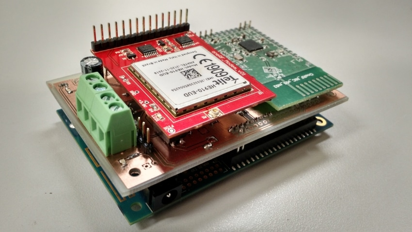
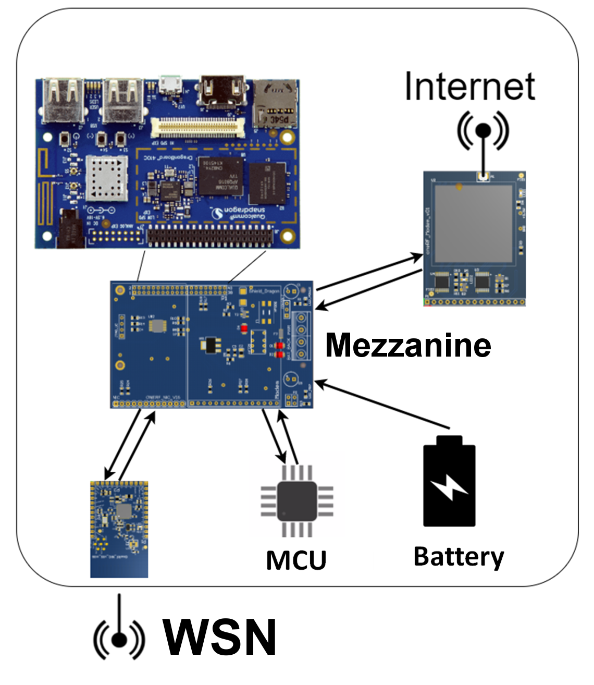

# IoT-6LoWPAN-gateway-v01

**Board description**

This project aims to add WSN (Wireless Sensor Network) connectivity to the DragonBoard 410C for applications that need low-cost, long-range and low data rate communication. The gateway should be able to operate in remote environments without direct 
human intervention. 

The IoT-6LoWPAN-gateway-v01 board features:
- 6loWPAN Sub-1GHz Radio (CC1310).
- 3G modem (Telit HE910-EUD). 
- Circuitry for automatic switch between AC Adapter power supply and backup battery. 
- Ultra-low power MCU to manage the board, monitor voltages, and works as an external watchdog with capability to reset the DragonBoard in case of error. 
- Noise, short circuit and overvoltage protection
- Shutdown and reset relay
- Power on LED
- A internal 3.3V regulator to power radio module and board circuitry.

*Attention: Power supply or battery is expected to have a nominal voltage of 12V, but it supports 8V to 15V. The DragonBoard is powered from the SYS_DCIN pins and is attached by the Low Speed Expansion Connector.

**Application example**

This board was initially built for the project [ReSeNI](https://github.com/oneRF/ReSeNI) as part of the 
[Brazilian partnership program](https://www.96boards.org/go/db410c-partnership-brazil).
It's a Smart City application for monitoring level in water reservoirs and trash cans arround the city.
**For more information, check the [INSTRUCTABLES](http://www.instructables.com/id/Inteligent-Level-Sensors-Network/)**

**Contact**

This is a ongoing project. If you have any suggestions or questions, please let us know.
Everybody is welcome to contribute!

- Rafael Christ at rafaelchrist@gmail.com
- Gustavo Pinheiro at gustavo_r_p@hotmail.com
- Anderson Vedoveto at andersonvedoveto@gmail.com

