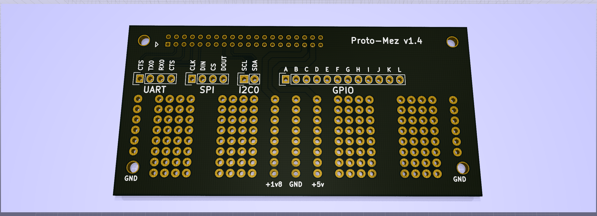

PROTO MEZZANINE
===============================================

This is a simple protyping mezzanine that breaks out the lowspeed header and provides a breadboard shaped prototyping area.

Copyright (c) 2017, Barry Byford
Copyright (c) 2017, Michael Welling
